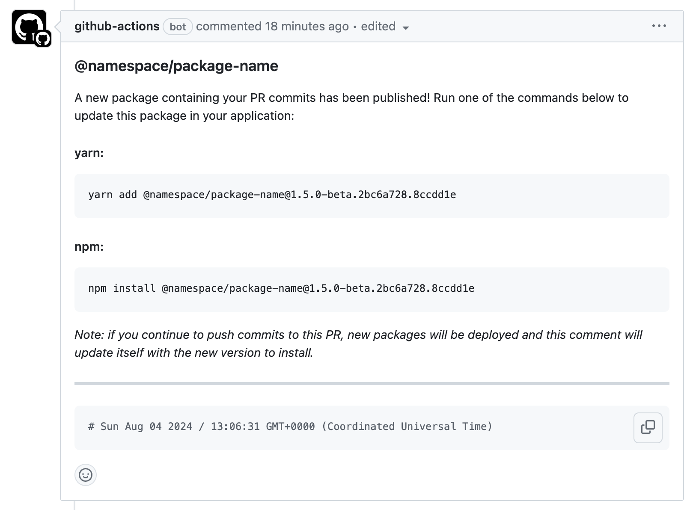
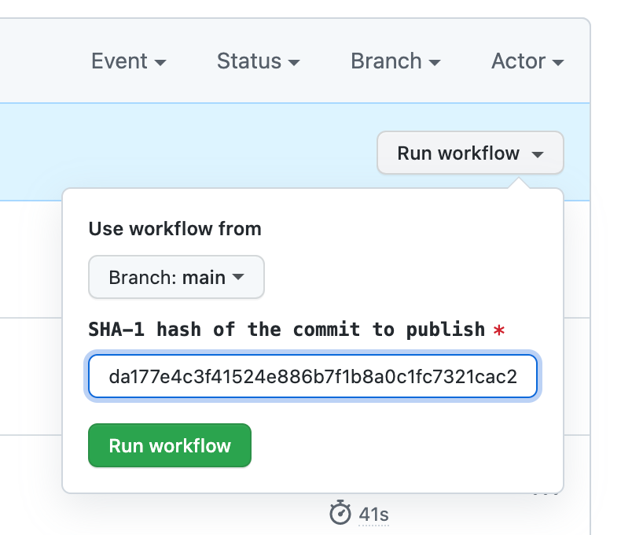
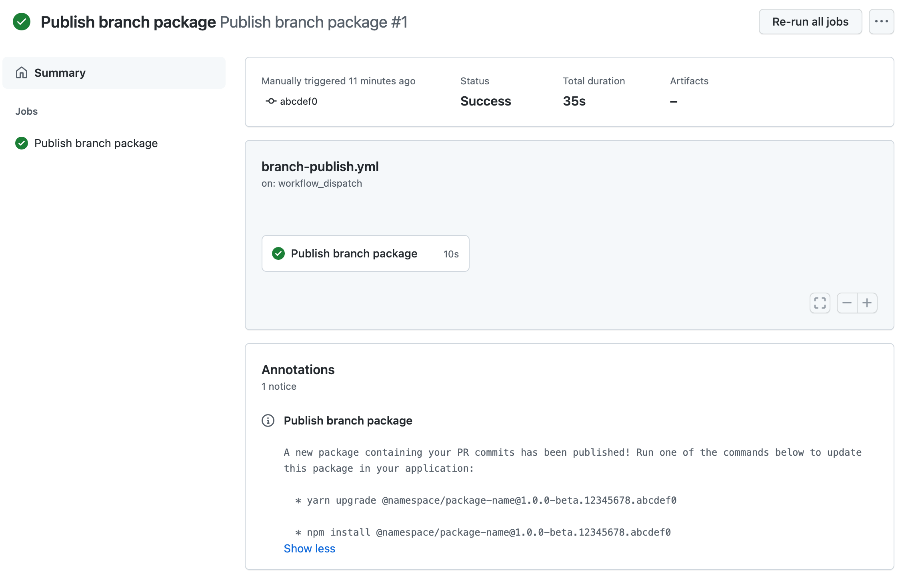

# publish-branch-to-npm

GitHub action to publish a pre-release version of an npm package to the registry.

## Inputs

### github_token

A token that GitHub automatically creates and stores in a `GITHUB_TOKEN` secret to use in your workflow.

### npm_token

An npm access token. See [https://docs.npmjs.com/creating-and-viewing-access-tokens](https://docs.npmjs.com/creating-and-viewing-access-tokens)

### dry_run

Does everything publish would do except actually publishing to the registry. Reports the details of what would have been published, see [npm publish docs](https://docs.npmjs.com/cli/v7/commands/npm-publish). `dry_run` is optional and defaults to `false`.

### commit_hash

The SHA-1 hash of the commit to publish; this is set automatically and does not need to be provided, unless `workflow_dispatch` trigger is used (see below).

## Usage

This action can be triggered by **`pull_request`** and **`workflow_dispatch`** event triggers:

### pull_request

Add the following step to your workflow job (after repo checkout, node setup, etc):

```yml
- name: Publish branch package to npm
  uses: wistia/publish-branch-to-npm@v1.0.0
  with:
    github_token: ${{ secrets.GITHUB_TOKEN }}
    npm_token: ${{ secrets.NPM_AUTH_TOKEN }}
```

`github_token` and `npm_token` are required inputs and this action cannot work without them.

When the action completes, you should see a comment like this in new Pull Requests:



If new commits are pushed to to a pre-existing branch, the comment will update itself with the new version instructions.

### workflow_dispatch

This action can also be triggered manually.

```yml
on:
  workflow_dispatch:
    inputs:
      commit_hash:
        description: 'SHA-1 hash of the commit to publish'
        required: true
---
- name: Publish branch package to npm
  uses: wistia/publish-branch-to-npm@mew/debugging
  with:
    github_token: ${{ secrets.GITHUB_TOKEN }}
    npm_token: ${{ secrets.NPM_AUTH_TOKEN }}
    commit_hash: ${{ github.event.inputs.commit_hash }}
```

Now if you visit the `Actions` tab in GitHub, and click on your workflow, there should now be a `Run workflow` button:



As opposed to the `pull_request` event trigger which can derrive `commit_hash`, here it must be provided. The commit used does not need to be merged to the default branch (ie. `main`) but it does need to be present in a branch accessible to GitHub.

When the action completes, you should see an annotation that looks like this:



## Development

### Releasing new versions to GitHub Marketplace

It's easiest to just use `npm` to manage the versioning:

1. `npm version [major, minor, patch]`_\*_ (_note: this will update the version field in `package.json`, create a tag with the new version number, run a build & commit those changes_)
2. `git push origin head --tags`
3. visit the [release](https://github.com/wistia/publish-branch-to-npm/releases) page, click `Draft new release` and fill out form

Read more about [publishing actions in GitHub Marketplace](https://docs.github.com/en/actions/creating-actions/publishing-actions-in-github-marketplace).
